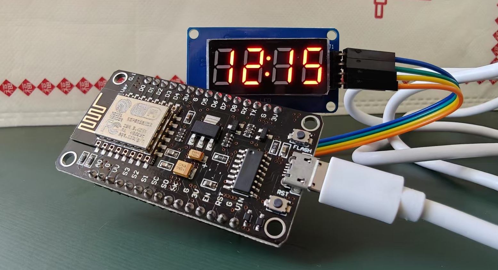
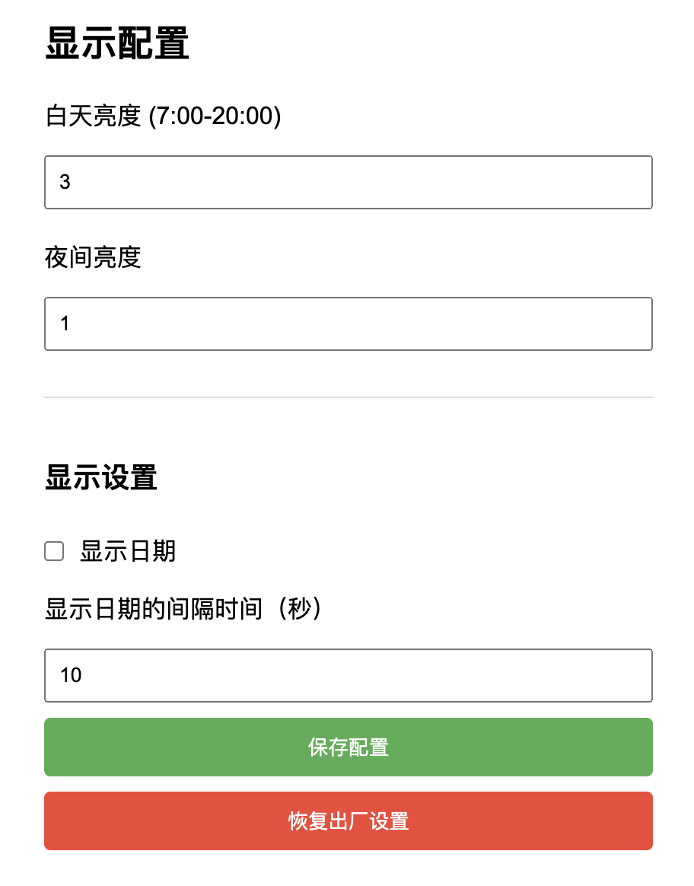

# ESP8266 Network Clock

A network clock project based on ESP8266 and TM1637 display module, supporting NTP time synchronization, WiFi configuration, brightness adjustment, and date display functions.

## Features

- Automatic NTP network time synchronization
- Smart WiFi configuration
- Date display switching support
- Day/night brightness auto-adjustment
- Web interface for remote configuration
- Configuration persistence after power loss
- Network reconnection mechanism

## Demo

The image above shows the actual running effect of the device. You can see the 4-digit LED display clearly showing the current time, with smart brightness adjustment ensuring clear visibility in different lighting conditions.

## Hardware Requirements

### Components Needed

- ESP8266 development board (NodeMCU, Wemos D1, etc.)
- TM1637 4-digit LED display module
- Micro USB cable (for power supply and programming)

### Wiring Instructions

| TM1637 Pin | ESP8266 Pin |
|------------|-------------|
| CLK        | D5          |
| DIO        | D6          |
| VCC        | 3.3V        |
| GND        | GND         |

## Usage Instructions

### Initial Setup

1. Power on the device, it will automatically enter configuration mode on first use
2. Connect to the WiFi hotspot named "ESP8266-Config" (password: 12345678) using your phone or computer
3. The configuration page will automatically pop up or can be accessed manually
4. On the configuration page, enter:
   - Your WiFi name and password
   - Display brightness (0-4 levels)
   - Date display options
   - Display switching interval
5. Click save, the device will automatically restart and connect to the configured WiFi network

### Web Configuration Interface

After the device successfully connects to WiFi, you can modify the configuration through these steps:

1. Check the device IP address (via router or serial monitor output)
2. Access the device IP address in a browser
3. In the Web interface, you can modify:
   - Display brightness settings
   - Date display toggle
   - Display switching interval
   - Factory reset

## Development Information

### Required Libraries

- TM1637Display
- ESP8266WiFi
- NTPClient
- TimeLib
- ESP8266WebServer

### Development Environment

1. Arduino IDE Settings:
   - Install ESP8266 board support
   - Select corresponding ESP8266 board
   - Set appropriate upload speed
   - Select correct COM port

2. Compile and Upload:
   - Ensure all dependency libraries are installed
   - Compile the code
   - Upload to the development board

### Main Features Explanation

- Automatic day/night brightness switching (7:00-20:00 is day mode)
- Hourly network time synchronization
- Automatic reconnection after network loss
- Configuration data stored in EEPROM
- Support for cycling between time and date display

## Important Notes

1. WiFi configuration is required for first use
2. Ensure good WiFi signal strength
3. Factory reset available through Web interface
4. Supported brightness range is 0-4 levels
5. Date display interval can be set between 5-60 seconds